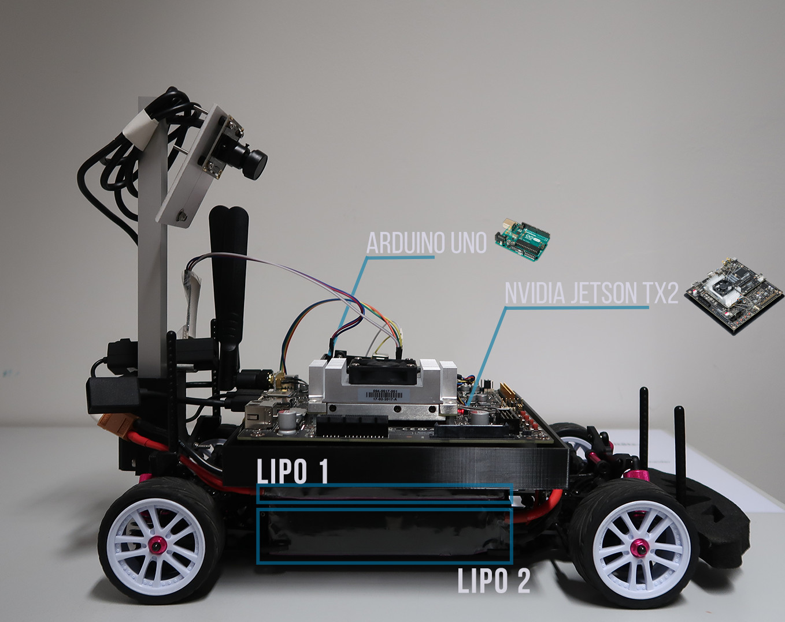
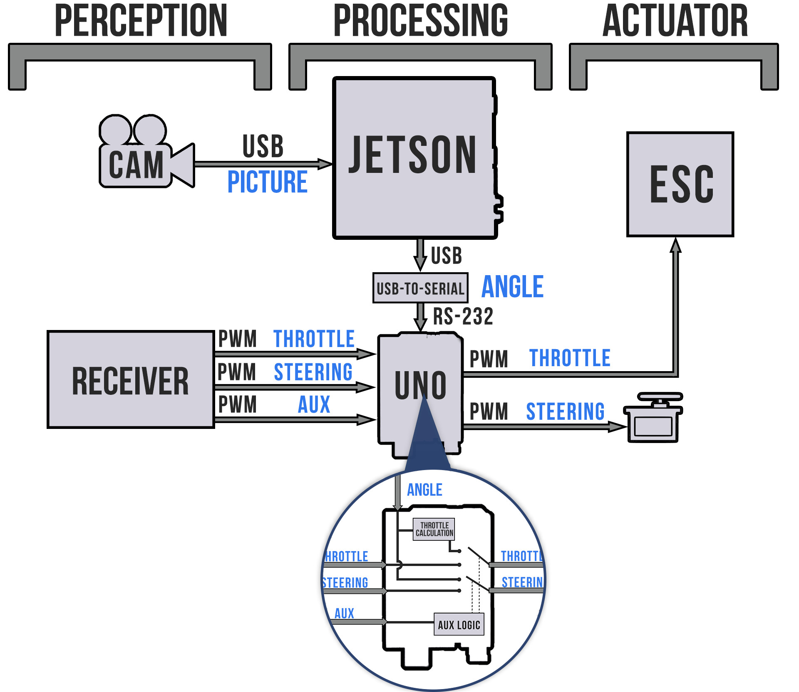
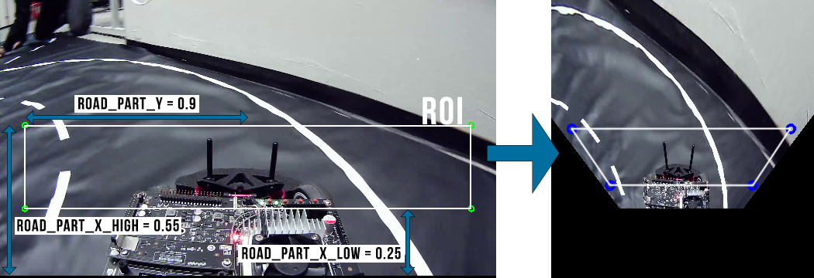

**Carolo Car**

The Carolo-Cup is a contest featuring 1:10 scaled RC cars which compete against each other in several disiciplines like autonomous driving, parking, obstacle detection etc.
We developed a complete system including hardware and software with the goal to participate in the Carolo Cup.
This repository contains our software stack incuding build toolchain, image processing, lane extraction and vehicle dynamic control.

**Vehicle setup**

The RC car consist of the following parts:

- 1:10 remote-controlled vehicle
- Eletrical power supply (2x LiPo batteries)
- Nvidia Jetson Tx 2 for perception, detection and communication
- Arduino Uno for actuator control

**Vehicle network**

In the following picture the communication between the parts is depicted.

**Software functionality**

**Line detection** 
The scene processing to extract the lane markings consists of several steps:

1. Birdview transformation + Region-of-interest (ROI) selection
3. Greyscale conversion
4. Gauß filtering
5. Canny edge detection
6. Hough Transformation

The whole processing can be observed in the following animation:

The whole processing is limited to a specific ROI which can be selected by the user.
This area gets transformed with the scene into the birdview which then forms a trapezoid.

